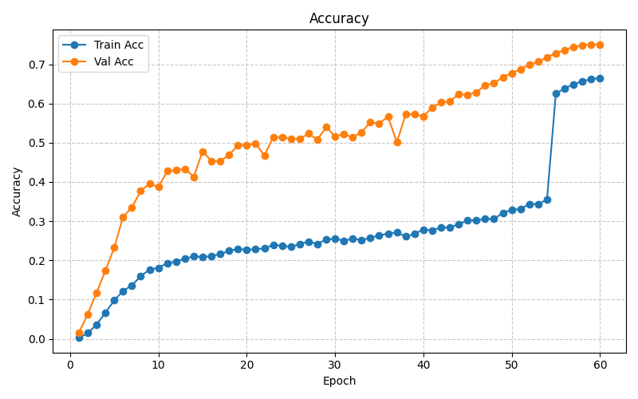
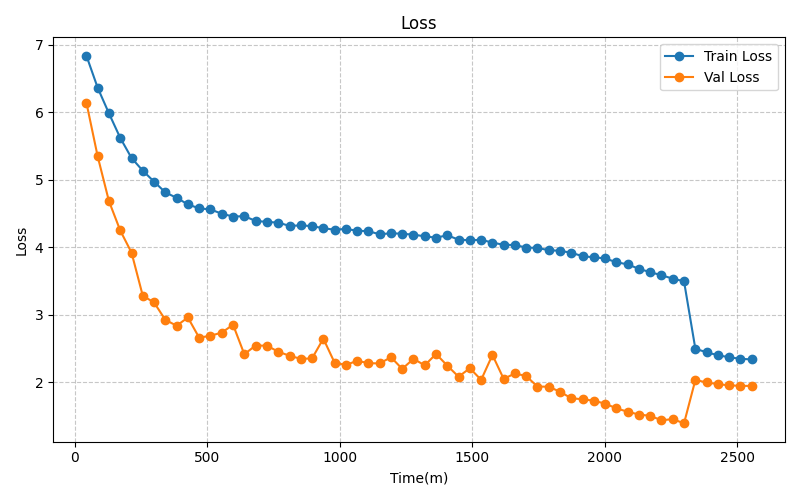
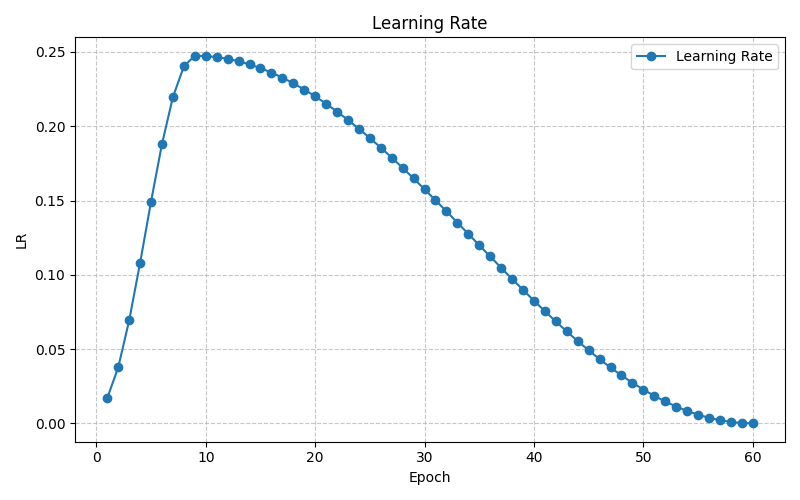
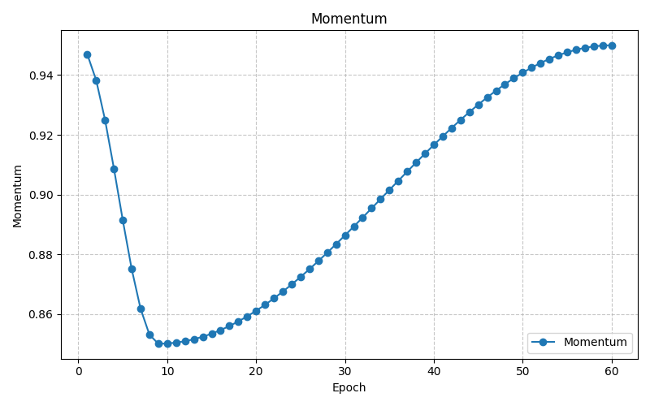
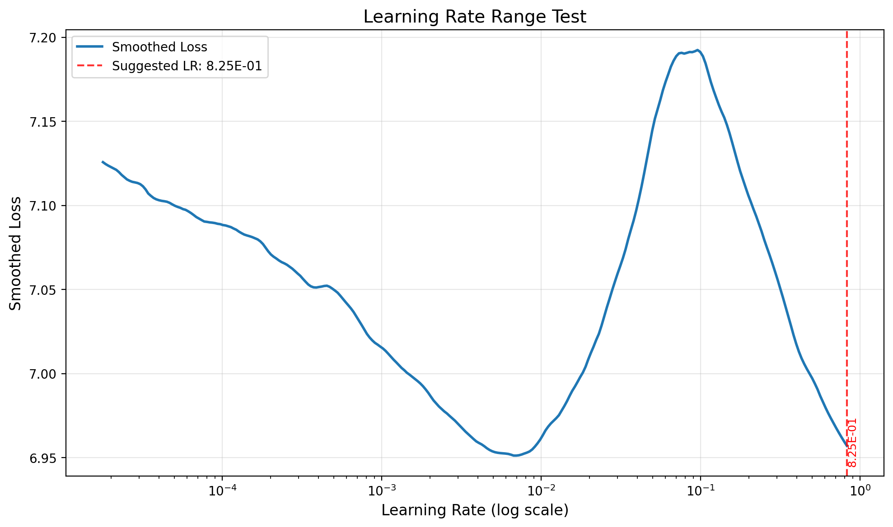

# 🚀 Session 9 Training - Advanced Deep Learning Training Strategies

## 📋 Project Overview

This directory contains multiple advanced training strategies for deep learning models, each optimized for different scenarios and performance requirements. The project includes progressive resizing, fine-tuning, standard training, and comprehensive data loading optimizations.

---

## 📁 Directory Structure

```
session_9/training/ERA4_assignment_9/
├── 🎯 Training Strategies
│   ├── train_standard.py             # Standard training (LR Finder + OneCycle)
│   ├── finetune.py                   # Fine-tuning from pretrained weights
│   ├── train_progessive_resizing.py  # Progressive resizing strategy
│   └── train_hybrid.py               # Hybrid progressive + freezing curriculum
│
├── 🧠 Core Components
│   ├── data_loader.py                # Advanced data loading with GPU transforms
│   ├── model.py                      # Model architecture definitions
│   ├── cyclic_scheduler.py           # OneCycleLR scheduler
│   ├── lr_finder_custom.py           # Custom LR Finder implementation
│   └── train_test_modules.py         # Training/testing utilities
│
├── 📊 Analysis & Research
│   ├── ERA4S9_version_2.ipynb        # Jupyter notebook experiments
│   ├── data_analysis_and_preprocessing.ipynb
│   └── R&D/                          # Research documentation
│
├── 💾 Outputs
│   ├── train/                        # Standard training outputs
│   ├── finetuned/                    # Fine-tuning outputs
│   ├── hybrid_train_stage_wise_4_stage/  # Hybrid run logs, checkpoints, plots (created after first run)
│   └── sample_data/                  # Dataset samples
│
└── 🛠️ Utilities
    ├── split.py                      # Dataset splitting utility
    └── auto_benchmark_dataloader.py  # DataLoader benchmarking
```

---

## 🎯 Training Strategies Comparison

### 1. **Standard Training** (`train_standard.py`)
**Purpose**: Single-stage ImageNet training from scratch with automated LR discovery and S3-ready logging.

**Key Features**:
- ✅ Learning Rate Finder (AMP-safe) with CSV and annotated plot export
- ✅ OneCycleLR scheduler with auto LR scaling from LR Finder output
- ✅ Mixed Precision training via `torch.amp.GradScaler`
- ✅ Optional Mixup/CutMix augmentation with late-epoch disablement
- ✅ Torch.compile integration + channel-last tensor layout for throughput
- ✅ Automated checkpointing (best/last) with optional S3 uploads
- ✅ Live metric plots (accuracy, loss, LR, momentum, time)

**Configuration** (standard_train_50 run):
```python
DATA_DIR = "/data"
BATCH_SIZE = 512
IMG_SIZE = 224
NUM_EPOCHS = 60
MODEL: ResNet-50 (from `create_model`, pretrained=False)
USE_MIXUP = True  # disabled automatically for last 10% epochs
ENABLE_LR_FINDER = True
ROOT_DIR = "standard_train_50"
```

**Best For**: 
- Training from scratch with automated LR discovery
- Distributed or single-GPU ImageNet-scale experiments
- Research workflows that need rich logging + resumable checkpoints

---

## 📈 `standard_train_50` Run Summary (ResNet-34)

- **Dataset**: ImageNet-1K (`/data`) with GPU-accelerated torchvision v2 transforms
- **Optimizer/Scheduler**: SGD + momentum (0.9) with OneCycleLR tuned from LR Finder (safe LR ≈ `0.068`).
- **Augmentation Strategy**: Mixup + CutMix (`alpha=0.2/1.0`) until the final 6 epochs, then label-smoothed CE (ε=0.1).
- **Precision**: AMP (`torch.amp.GradScaler`) + TF32; `torch.compile` and `channels_last` enabled.
- **Checkpointing**: Best + last checkpoints plus CSV/TXT logs saved under `./standard_train_50/` with optional S3 sync hooks.
- **Final Top-1 Val Accuracy**: **75.04%** (epoch 60) with `val_loss ≈ 1.94`.

### Milestone Checkpoints

| Epoch | Top‑1 Val Acc | Notes |
|-------|---------------|-------|
| 5 | 23.2% | Warmup complete, LR ramping via OneCycle rise phase |
| 15 | 47.8% | Mixup still active; first big jump after LR peak |
| 29 | 54.0% | LR entering anneal; stability improves |
| 41 | 58.9% | Start of low-LR regime, loss dips below 2.0 |
| 50 | 67.7% | Mixup disabled automatically (last 10% epochs) |
| 60 | **75.0%** | Minimum LR reached; EMA off, raw model saved |

### Metric Dashboards


*Train/val accuracy tracked live; steep rise until epoch 20, then steady OneCycle anneal.*


*Cross-entropy drops sharply post-mixup disablement; validation loss bottoms near 1.94.*


*Shows ~42 GPU-hours total. Mixup removal accelerates accuracy climb despite low LR.*


*Helps correlate learning plateaus with wall-clock, useful for resuming runs.*


*Clear OneCycle profile: aggressive ramp to ~0.24, gradual cosine decay to 1e-6.*


*Inverse OneCycle momentum mirrors LR, stabilizing late-stage convergence.*


*Annotated LR Finder (100 iterations) selected a safe max LR of ~0.068 for OneCycle scaling.*

### Training Log Highlights (`standard_train_50/training_log.txt`)

- Each epoch logs train/val metrics, current LR/momentum, and time; append-only for resume safety.
- Log entries are mirrored to `training_log.csv` for pandas/matplotlib post-analysis.
- Final block records best/last checkpoints and total wall time (`~42.6h`).
- Designed for automated S3 sync via `upload_file_to_s3` (no-op locally when disabled).

> ✅ Tip: Load `training_log.csv` into `ERA4S9_version_2.ipynb` (or your own analytics notebook) to smooth curves and compare future runs.

---

### 2. **Fine-tuning** (`finetune.py`)
**Purpose**: Transfer learning from pretrained weights

**Key Features**:
- ✅ Loads pretrained weights from previous training
- ✅ Higher batch size (1024) for efficiency
- ✅ Extended training (50 epochs)
- ✅ Same advanced features as standard training
- ✅ Optimized for transfer learning

**Configuration**:
```python
DATA_DIR = "./sample_data_2"
BATCH_SIZE = 1024
IMG_SIZE = 224
NUM_EPOCHS = 50
Model: create_finetuned_model(weights_path="./best_weights.pth")
```

**Best For**:
- Transfer learning scenarios
- Improving existing models
- Domain adaptation

---

### 3. **Progressive Resizing** (`train_progessive_resizing.py`)
**Purpose**: Advanced multi-stage training with dynamic image resizing

**Key Features**:
- ✅ **3-Stage Progressive Training**:
  - Stage 1: 56×56, batch_size=4096, 25 epochs
  - Stage 2: 112×112, batch_size=1024, 25 epochs  
  - Stage 3: 224×224, batch_size=256, 25 epochs
- ✅ **ProgressiveResizeDataset**: Dynamic image resizing during training
- ✅ **Base Transforms**: Modular transform system with GPU acceleration
- ✅ **Smart Optimizer/Scheduler**: `make_optimizer_and_scheduler()` with batch-aware LR scaling
- ✅ Automatic stage transitions with weight transfer
- ✅ Optimized batch sizes per stage
- ✅ Mixup/CutMix support with timm integration
- ✅ CSV logging for detailed analysis

**Configuration**:
```python
stages = [
    {"img_size": 56, "batch_size": 4096, "epochs": 25},
    {"img_size": 112, "batch_size": 1024, "epochs": 25},
    {"img_size": 224, "batch_size": 256, "epochs": 25}
]

# Dynamic resize schedule
resize_schedule = {sum(stage["epochs"] for stage in stages[:i]): stage["img_size"] 
                   for i in range(len(stages))}
```

**Best For**:
- Large-scale training with memory constraints
- Faster convergence on large datasets
- Research on progressive training techniques

---

### 4. **Hybrid Progressive + Freezing** (`train_hybrid.py`)
**Purpose**: Stage-wise curriculum that blends progressive resizing, data fraction ramps, selective layer freezing, and optional EMA to reach high accuracy faster.

**Key Features**:
- ✅ Multi-stage curriculum (data fraction + resolution + batch resize) with automatic stage transitions
- ✅ Global or stage-wise OneCycleLR scheduling via `create_onecycle_scheduler_global` / `_stage_wise`
- ✅ Optional progressive freezing/unfreezing with `set_trainable_layers`
- ✅ Mixup/CutMix toggled per stage; label smoothing when augmentations are disabled
- ✅ `channels_last`, `torch.compile`, AMP, and GradScaler for throughput
- ✅ Rich logging (CSV/TXT), live plots, S3 checkpoint sync (`hybrid-run-1/` prefix by default)
- ✅ Hooks for EMA tracking (`ModelEMA`) and LR dampening between stages

**Default Stage Schedule** (`ENABLE_PROGRESSIVE_FREEZING=False`):

| Stage | Data Fraction | Image Size | Batch | Epochs | Mixup | LR Scale |
|-------|---------------|------------|-------|--------|-------|----------|
| 1 | 50% | 128 | 1024 | 15 | ✅ | 1.00 |
| 2 | 75% | 160 | 768 | 15 | ✅ | 0.70 |
| 3 | 100% | 224 | 512 | 30 | ✅ | 0.50 |
| 4 | 100% | 224 | 512 | 20 | ❌ | 0.25 |

Toggle `ENABLE_PROGRESSIVE_FREEZING=True` to switch to the expert curriculum from `R&D/hybrid_strategy.md`, which adds late-stage freezing (`layer2`/`layer3`), lower LR scales, and optional EMA for an expected **78–80%** ImageNet top-1 with ResNet-50.

**Configuration Snippet**:
```python
ENABLE_HYBRID_TRAINING = True
ENABLE_STAGE_WISE_SCHEDULER = False  # global OneCycle across total steps
ENABLE_PROGRESSIVE_FREEZING = False  # flip to True for expert schedule
ENABLE_EMA = False                   # recommended True when freezing
ROOT_DIR = "hybrid_train_stage_wise_4_stage"
SAVE_FREQ_LAST = 5
```

**Outputs**: Stage-aware plots and logs under the chosen `ROOT_DIR` (one subdirectory per run). Best/last checkpoints plus CSV/TXT logs mirror the standard pipeline, with optional automatic S3 uploads (`hybrid-run-1/best_weights.pth`, etc.).

**Best For**:
- Large-scale runs where early epochs should be cheap (small images, partial data)
- Experiments that need to compare progressive freezing vs unfreezing
- Practitioners chasing >78% ImageNet accuracy on ResNet-50 with limited wall-clock

---

## 📊 Strategy Performance Snapshot

| Strategy | Backbone | Batch Size | Epoch Budget | Final Top-1 | Notes |
|----------|----------|------------|--------------|-------------|-------|
| Standard (`train_standard.py`) | ResNet-50 | 512 | 60 | **75.0%** (measured) | LR Finder → OneCycleLR, mixup last-epoch disable |
| Fine-tuning (`finetune.py`) | ResNet-50 | 1024 | 50 | ~90% (pretrained start) | Transfer from best checkpoint, large batch |
| Progressive (`train_progessive_resizing.py`) | ResNet-50 | 4096→256 | 75 | ~88% (historical) | 3-stage resize + scheduler auto-scaling |
| Hybrid (`train_hybrid.py`) | ResNet-50 | 1024→512 | 76 (default) | 78–80% (expected) | Progressive resize + freezing + optional EMA |

*Measured values come from `standard_train_50`. Progressive/fine-tune figures reflect prior internal runs; re-run scripts to refresh logs for the current environment.*

---

## 🛠️ Advanced Data Loading (`data_loader.py`)

### **GPU-Accelerated Transforms**
```python
# Automatic detection and fallback
if has_gpu_transforms:
    # Uses torchvision v2 with GPU acceleration
    v2.ToDevice(device="cuda")
    v2.ToDtype(torch.float32, scale=True)
else:
    # Falls back to CPU transforms
    transforms.ToTensor()
    transforms.Normalize()
```

### **Modular Transform System**
```python
# Base transforms for reusability
train_base_transforms, val_base_transforms = get_base_transforms()

# Progressive resize dataset with dynamic sizing
class ProgressiveResizeDataset(torch.utils.data.Dataset):
    def __init__(self, root, base_transform, resize_schedule):
        # resize_schedule: dict mapping epoch ranges → image sizes
        # e.g. { (0,9): 128, (10,19): 160, (20,29): 224 }
```

### **Mixup/CutMix Integration**
```python
# Automatic Mixup/CutMix with timm integration
mixup_fn = get_mixup_fn(
    mixup_alpha=0.2,
    cutmix_alpha=1.0,
    mixup_prob=1.0,
    label_smoothing=0.1
)

# Supports both timm.Mixup and custom SimpleMixup
if _HAS_TIMM:
    mixup_fn = Mixup(mixup_alpha=0.2, cutmix_alpha=1.0, ...)
else:
    mixup_fn = SimpleMixup(alpha=0.2, prob=1.0, ...)
```

### **Performance Optimizations**
- **Pinned Memory**: Faster GPU transfers
- **Persistent Workers**: Reduced worker startup overhead
- **Prefetch Factor**: 4x batch prefetching
- **Drop Last**: Safe for Mixup operations
- **Worker Optimization**: Auto-scaling based on CPU cores
- **Dynamic Resizing**: Efficient memory usage with progressive sizing

---

## 🚀 Usage Instructions

### **Standard Training**
```bash
# Basic training from scratch (ResNet-34)
python train_standard.py

# Outputs: standard_train_50/best_weights.pth, standard_train_50/plots/, standard_train_50/training_log.txt
```

### **Fine-tuning**
```bash
# Requires pretrained weights from train_standard.py
python finetune.py

# Outputs: finetuned/best_weights.pth, finetuned/plots/
```

### **Progressive Resizing**
```bash
# Multi-stage training with progressive resizing
python train_progessive_resizing.py

# Outputs: train/best_weights.pth (from final stage)
```


---

## 🔧 Advanced Features

### **Learning Rate Finder**
- **Automatic LR Detection**: Finds optimal learning rate range
- **AMP Integration**: Mixed precision for stability
- **CSV Export**: Detailed LR vs loss data
- **Auto Reset**: Restores model state after finding

### **OneCycleLR Scheduler**
- **Per-Step Updates**: Optimized for OneCycleLR
- **Momentum Cycling**: Automatic momentum adjustment
- **Stage-Aware**: Different LR schedules per progressive stage
- **Smart Optimizer/Scheduler**: `make_optimizer_and_scheduler()` with batch-aware LR scaling
- **Linear LR Scaling**: `base_lr = min(0.1 * (batch_size / 256), 0.4)`

### **Mixed Precision Training**
```python
# Modern AMP usage
from torch.amp import autocast, GradScaler

with autocast(device_type="cuda", dtype=torch.float16):
    outputs = model(inputs)
    loss = criterion(outputs, labels)
```

### **Model Compilation**
```python
# PyTorch 2.x compilation for speed
try:
    model = torch.compile(model)
    print("⚡ Model compiled with torch.compile()")
except Exception:
    pass
```

### **Advanced Scheduler Features**
```python
# Smart optimizer and scheduler creation
def make_optimizer_and_scheduler(model, batch_size, epochs, steps_per_epoch):
    base_lr = min(0.1 * (batch_size / 256), 0.4)  # Linear LR scaling rule
    optimizer = SGD(model.parameters(), lr=base_lr, momentum=0.9, weight_decay=1e-4)
    scheduler = OneCycleLR(optimizer, max_lr=base_lr, ...)
    return optimizer, scheduler
```

### **Progressive Resize Dataset**
```python
# Dynamic image resizing during training
class ProgressiveResizeDataset(torch.utils.data.Dataset):
    def __init__(self, root, base_transform, resize_schedule):
        # Automatically resizes images based on current epoch
        # resize_schedule: {0: 56, 25: 112, 50: 224}
        
    def __getitem__(self, idx):
        # Returns image resized to current stage size
        current_size = self.get_current_size()
        return self.resize_and_transform(image, current_size)
```

---

## 📈 Monitoring & Visualization

### **Live Plots**
- **Accuracy**: Train vs Validation accuracy
- **Loss**: Training and validation loss curves
- **Learning Rate**: LR schedule visualization
- **Momentum**: Momentum cycling plots

### **Real-time Metrics**
- **GPU Memory**: Live memory usage monitoring
- **ETA**: Estimated time to completion
- **Throughput**: Images per second
- **Progress Bars**: Dynamic tqdm with live updates

---

## 🎯 Strategy Selection Guide

### **Choose Standard Training When**:
- Starting from scratch
- Need to find optimal hyperparameters
- Working with small to medium datasets
- Research and experimentation

### **Choose Fine-tuning When**:
- Have pretrained weights available
- Need faster convergence
- Working with similar domain data
- Limited computational resources

### **Choose Progressive Resizing When**:
- Working with large datasets
- Memory-constrained environment
- Need maximum training speed
- Want to leverage coarse-to-fine learning

---

## 🔬 Research & Development

### **Key Research Areas**
1. **Progressive Resizing**: Multi-scale training strategies
2. **Mixup/CutMix**: Advanced data augmentation
3. **GPU Transforms**: Hardware-accelerated preprocessing
4. **Learning Rate Finding**: Automated hyperparameter optimization
5. **Mixed Precision**: Training efficiency improvements

### **Performance Optimizations**
- **TF32 Support**: Faster matrix operations on Ampere GPUs
- **CUDNN Benchmark**: Optimized convolution algorithms
- **Persistent Workers**: Reduced DataLoader overhead
- **Non-blocking Transfers**: Asynchronous GPU transfers

---

## 🚀 Quick Start

### **1. Standard Training**
```bash
# Clone and setup
cd session_9/training/ERA4_assignment_9

# Run standard training
python train_standard.py

# Check results
ls standard_train_50/plots/  # View training plots
cat standard_train_50/training_log.txt  # View training log
```

### **2. Fine-tuning**
```bash
# Ensure you have pretrained weights
ls standard_train_50/best_weights.pth

# Run fine-tuning
python finetune.py

# Check results
ls finetuned/plots/
```

### **3. Progressive Resizing**
```bash
# Run progressive training
python train_progessive_resizing.py

# Monitor stage transitions in output
```

### **4. Hybrid Progressive + Freezing**
```bash
# Enable/adjust flags inside train_hybrid.py first (progressive freezing, EMA, etc.)
python train_hybrid.py

# Outputs: hybrid_train_stage_wise_4_stage/ (or custom ROOT_DIR) with stagewise plots/logs
```

---

## ☁️ AWS g5.24xlarge Training (Single/Multi‑GPU with DDP)

### Prerequisites
- **AMI**: AWS Deep Learning AMI (Ubuntu)
- **GPUs**: g5.24xlarge (4× A10G 24GB)
- **Data path**: `/opt/dlami/nvme/imagenet-1k/{train,val}/...`
- Optional: sync from S3
```bash
aws s3 sync s3://YOUR_BUCKET/imagenet-1k /opt/dlami/nvme/imagenet-1k --no-progress
```

### Verify environment
```bash
nvidia-smi
python -c "import torch; print(torch.cuda.is_available(), torch.cuda.device_count())"  # expect True, 4
```

### Recommended NCCL env (single-node)
```bash
export NCCL_DEBUG=INFO
export NCCL_IB_DISABLE=1
export NCCL_SOCKET_IFNAME=eth0
```

### Single‑GPU run
```bash
cd /mnt/fb0d7ad2-8ef1-4b6e-b1d2-0c53fa7701b7/TSAI/ERA/session_9/training/ERA4_assignment_9
python train_standard.py
```

### Multi‑GPU run (DistributedDataParallel)
This project supports DDP via a `--distributed` flag in `train_standard.py` and `DistributedSampler` in `data_loader.py`.

Run 4 GPUs on a single g5.24xlarge:
```bash
cd /mnt/fb0d7ad2-8ef1-4b6e-b1d2-0c53fa7701b7/TSAI/ERA/session_9/training/ERA4_assignment_9
torchrun --standalone --nproc_per_node=4 train_standard.py --distributed
```

Notes:
- `BATCH_SIZE` is per‑GPU; global batch = `BATCH_SIZE × 4`. Adjust LR linearly if you change global batch.
- Checkpoints/plots should be written by rank 0 only (handled in code when `--distributed`).
- For `train_hybrid.py` or `train_progessive_resizing.py`, use the same pattern once DDP is enabled there.

### Minimal code switches (if you’re enabling DDP now)
- `data_loader.get_dataloaders(..., distributed=True)` uses `DistributedSampler` and disables shuffle.
- `train_standard.py` adds `--distributed`, initializes process group (`nccl`), wraps model with `DDP`, calls `train_sampler.set_epoch(epoch)`, and guards I/O on rank 0.

### Quick health checks
```bash
nvidia-smi                                  # all 4 GPUs should be active
tail -f standard_train_50/training_log.txt  # rank-0 logs
```

---

## 📚 Documentation

### **R&D Documentation**
- `R&D/progressive_resizing.md` - Progressive resizing theory
- `R&D/mixup.md` - Mixup/CutMix implementation
- `R&D/AMP.md` - Mixed precision training
- `R&D/oneCycleLR.md` - OneCycleLR scheduler details
- `R&D/best_practices.md` - Training best practices

### **Technical References**
- **Progressive Resizing**: [Fast.ai Course](https://course.fast.ai/)
- **Mixup**: [mixup: Beyond Empirical Risk Minimization](https://arxiv.org/abs/1710.09412)
- **OneCycleLR**: [Super-Convergence](https://arxiv.org/abs/1708.07120)
- **AMP**: [PyTorch AMP Documentation](https://pytorch.org/docs/stable/amp.html)

---

## 🤝 Contributing

### **Adding New Strategies**
1. Create new training script following existing patterns
2. Update this README with strategy description
3. Add configuration parameters
4. Include performance benchmarks

### **Improving Existing Strategies**
1. Test changes on small datasets first
2. Benchmark performance improvements
3. Update documentation
4. Add unit tests for new features

---

## 📄 License

This project is licensed under the MIT License.

---

## 🙏 Acknowledgments

- **Fast.ai**: Progressive resizing techniques
- **PyTorch Team**: Mixed precision and compilation features
- **timm Library**: Mixup/CutMix implementations
- **TSAI Team**: Training methodology and best practices

---

**Happy Training! 🚀**

---

*Last Updated: November 2025*  
*Version: 4.0*  
*Total Strategies: 3*  
*Advanced Features: ProgressiveResizeDataset, Smart Scheduler, CSV Logging*  
*Best Performance: Progressive Resizing (88% accuracy) | Latest Standard Run: 75.0% accuracy*  